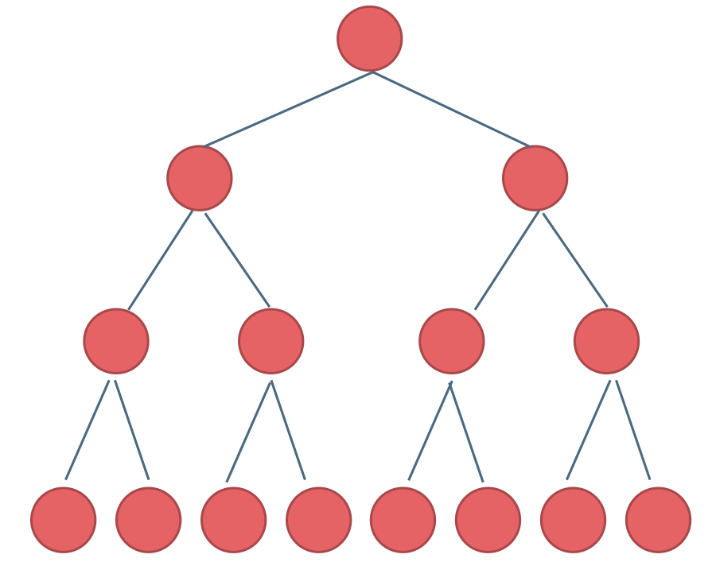

# 二叉树


## 二叉树的种类

### 满二叉树和完全二叉树

解题中的二叉树一般为**满二叉树**和**完全二叉树**

**满二叉树**：节点度只有 0 和 2，且度为 0 的节点在同一层的二叉树
- 深度为 $k$
- 结点数为 $2^k-1$



**完全二叉树**：除了底层节点，其余层的节点数都为最大值

### 二叉搜索树

**具有数值的有序树**，结点数值规则：
- 左子树非空，左子树结点值均小于根节点值
- 右子树非空，右子树结点值均大于根节点值
- 左、右子树同样为二叉搜索树

### 平衡二叉搜索树（AVL）

性质：空树，或左右子树高度差不超过 1，并且左右子树都为 AVL


## 二叉树的遍历方式

### 深度优先遍历

```cpp
void DepthSearch(TreeNode* root, vector<int>& res) {  // res 是结果
    // 递归终止条件
    if (!root) {
        return;
    }

    // 这里根据遍历的顺序来进行调整，即可实现三种遍历
    res.push_back(root->val);
    DepthSearch(root->left, res);
    DepthSearch(root->right, res);
}
```

迭代遍历：

```cpp
stack<TreeNode*> s;
s.push(x);  // 初始化栈
while (!s.empty()) {  // 栈非空就继续遍历
    TreeNode* cur = s.top();
    s.pop();
    // do something
    
    s.push(x);  // 填充栈
}
```

1. 前序遍历（递归法，迭代法）中左右
2. 中序遍历（递归法，迭代法）左中右
3. 后序遍历（递归法，迭代法）左右中

### 广度优先遍历

可以借助队列实现


## 二叉树的性质

- 性质 1：二叉树第 `i` 层上的节点数目最多为 `2{i-1} (i≥1)`。
- 性质 2：深度为 `k` 的二叉树至多有 `2{k}-1` 个节点`（k>=1）`。
- 性质 3：包含 `n` 个节点的二叉树的高度至少为 `log2 (n+1)`。
- 性质 4：在任意一颗二叉树中，若终端节点的个数为 `n0`，度为 `2` 的节点数为 `n2`，则 `n0=n2+1`


## 二叉树的修改与构造

## 求二叉搜索树的属性

## 二叉树公共祖先问题

## 二叉搜索树的修改与构造


# 参考链接

- [二叉树知识点最详细最全讲解](https://blog.csdn.net/qq_41404557/article/details/115447169)
- [二叉树理论基础](https://github.com/youngyangyang04/leetcode-master/blob/master/problems/%E4%BA%8C%E5%8F%89%E6%A0%91%E7%90%86%E8%AE%BA%E5%9F%BA%E7%A1%80.md)