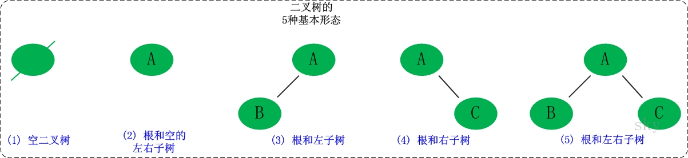

# 二叉树

## 二叉树的性质

- 性质 1：二叉树第 `i` 层上的节点数目最多为 `2{i-1} (i≥1)`。
- 性质 2：深度为 `k` 的二叉树至多有 `2{k}-1` 个节点`（k>=1）`。
- 性质 3：包含 `n` 个节点的二叉树的高度至少为 `log2 (n+1)`。
- 性质 4：在任意一颗二叉树中，若终端节点的个数为 `n0`，度为 `2` 的节点数为 `n2`，则 `n0=n2+1`

## 二叉树的遍历方式

### 深度优先遍历

1. 前序遍历（递归法，迭代法）中左右
2. 中序遍历（递归法，迭代法）左中右
3. 后序遍历（递归法，迭代法）左右中

### 广度优先遍历

- 层次遍历

# 参考链接

- [二叉树知识点最详细最全讲解](https://blog.csdn.net/qq_41404557/article/details/115447169)