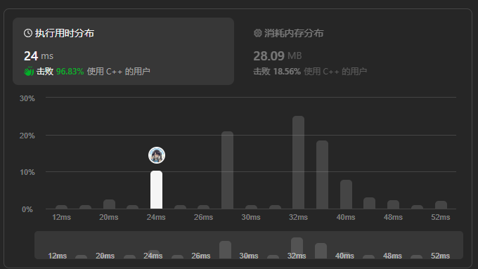

# [209 长度最小的子数组](https://leetcode.cn/problems/minimum-size-subarray-sum/)

给定一个含有 `n` 个正整数的数组和一个正整数 `target` 。

找出该数组中满足其总和大于等于 `target` 的长度最小的 连续子数组 `[numsl, numsl+1, ..., numsr-1, numsr]` ，并返回其长度。如果不存在符合条件的子数组，返回 `0` 。

 

示例 1：
```cpp
输入：target = 7, nums = [2,3,1,2,4,3]
输出：2
解释：子数组 [4,3] 是该条件下的长度最小的子数组。
```

示例 2：
```cpp
输入：target = 4, nums = [1,4,4]
输出：1
```

示例 3：
```cpp
输入：target = 11, nums = [1,1,1,1,1,1,1,1]
输出：0
```

提示：

- `1 <= target <= 109`
- `1 <= nums.length <= 105`
- `1 <= nums[i] <= 105`
 

进阶：

- 如果你已经实现 $O(n)$ 时间复杂度的解法, 请尝试设计一个 $O(n log(n))$ 时间复杂度的解法。

# 题解

双指针法（滑动窗口）

- `slow`指针：记录本次子数组起始位置
- `fast`指针：遍历原数组
- 遍历中：定slow移动fast
  - `sums+=nums[fast]`
  - 判断`sums >= target`
    - 是，则移动`slow`指针，移动slow定fast
    - 否，则移动`fast`指针，即外部遍历

代码实现：
```cpp
int minSubArrayLen(int target, vector<int>& nums)
{
    int slow = 0;
    int sums = 0;
    int len = nums.size() + 1;
    for(int fast = 0; fast<nums.size();++fast)
    {
        sums += nums[fast];
        while(sums >= target)
        {
            // 进入循环就是满足条件的子数组，就需要记录此时长度
            len = min(len, fast-slow+1);
            // 开始查询子数组的子数组
            sums -= nums[slow++];
            // 从sums中减去slow，再移动slow
        }
    }
    return (len==nums.size()+1)?0:len;
}
```

- **注意**：这里在初始化`len`时，使用的是`nums.size()+1`
  - 原因在于，将nums全部元素加起来，即`sum(nums)`既有可能正好等于`target`也可能不满足条件
  - 如果此时`len = nums.size()`，则此时两种情况都是`len=nums.size()`
    - 前者会在最后一次满足条件后执行`len = min(len, fast-slow+1);`语句
    - 后者则完全不会进入while循环，即不会更新`len`
  - 所以设置`len = nums.size()+1`，目的是区别这两种情况

提交结果：



