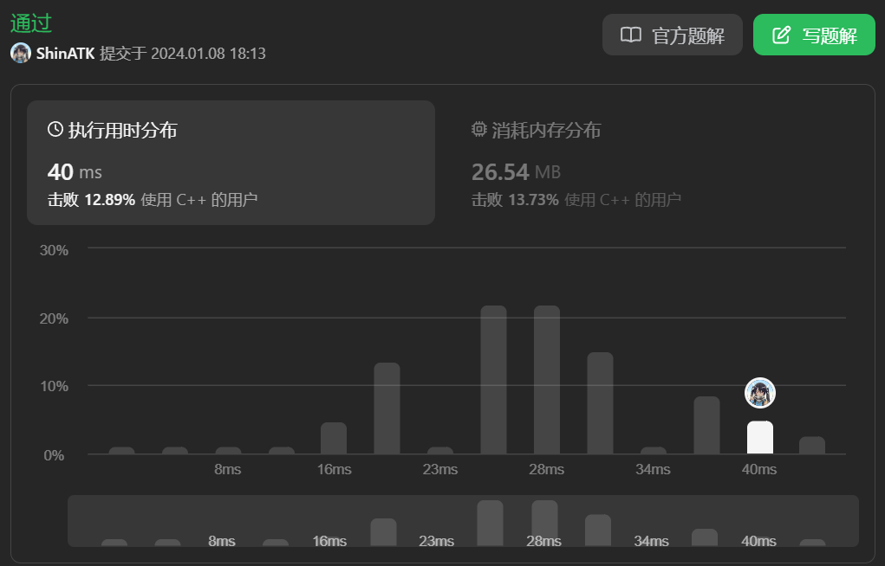

# [977 有序数组的平方](https://leetcode.cn/problems/squares-of-a-sorted-array/description/)

给你一个按 非递减顺序 排序的整数数组 `nums`，返回 每个数字的平方 组成的新数组，要求也按 非递减顺序 排序。

示例 1：
```cpp
输入：nums = [-4,-1,0,3,10]
输出：[0,1,9,16,100]
解释：平方后，数组变为 [16,1,0,9,100]
排序后，数组变为 [0,1,9,16,100]
```

示例 2：
```cpp
输入：nums = [-7,-3,2,3,11]
输出：[4,9,9,49,121]
```
提示：

- `1 <= nums.length <= 104`
- `-104 <= nums[i] <= 104`
- `nums` 已按 非递减顺序 排序
 

进阶：

请你设计时间复杂度为 $O(n)$ 的算法解决本问题

# 题解

## 方法一：直接法 1

- 创建另一个数组 `nums_square`
- 遍历 `nums`，依次计算各元素平方并存入数组 `nums_square`
- 最后对 `nums_square` 进行排序

代码：
```cpp
class Solution {
public:
    vector<int> sortedSquares(vector<int>& nums) {
        vector<int> nums_square;
        for(auto i:nums)
        {
            nums_square.push_back(i*i);
        }
        sort(nums_square.begin(), nums_square.end());

        return nums_square;
    }
};
```

复杂度分析：
- 时间复杂度：遍历 `nums` 为 $O(n)$，对`nums_square`使用`sort`排序为 $O(n\log{n})$，可得最终时间复杂度为：$O(n\log{n})$
- 空间复杂度：`nums_square`额外占据 $O(n)$ 空间

提交结果：


## 方法二：原地法 2

和方法一相同，只是原地操作

代码如下：
```cpp
class Solution {
public:
    vector<int> sortedSquares(vector<int>& nums) {
        for(int i=0;i<nums.size();++i)
        {
            nums[i] = pow(nums[i], 2);
        }
        sort(nums.begin(), nums.end());
        return nums;
    }
};
```

复杂度分析：
- 时间复杂度：和方法一相同，$O(n\log{n})$
- 空间复杂度：因为没有额外引入数组，所以是 $O(1)$

提交记录：
